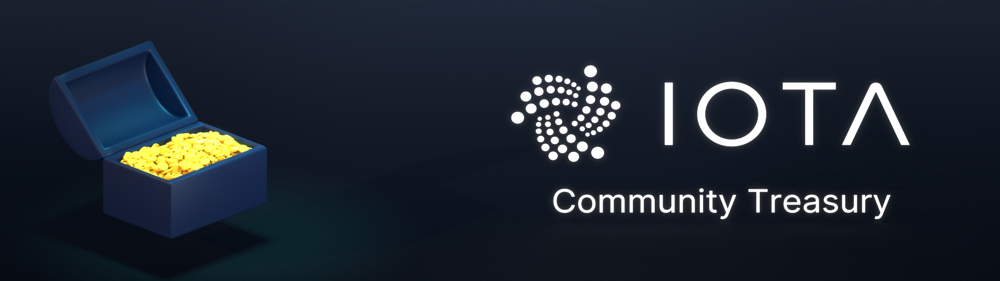

<!-- IOTA Treasury Governance Info Thread -->
# IOTA Treasury Governance Info Thread

The involved community members hope to give the community in this thread the most recent updates and info on how the IOTA community approaches and develops the upcoming vote for or against a community-controlled governance structure.
And we also hope to inform a broader part of the community about the ongoing discussion and actions and invite everyone to participate and get actively involved in this important topic.

<!-- GENERAL INFORMATION AND HISTORY OF THE TOKENS -->
## General Information and history of the Tokens:

The community has been offered the option to decide the future destiny of unclaimed tokens from the initial crowd sale and some network upgrades in 2017.
As these tokens are no longer under the control of any single entity, a decision must be made about their future. The tokens should either be under the control of the community or should be destroyed.

This first decision about the future of the tokens was taken by the node operators following the Chrysalis network upgrade in April 2021. Node operators had two options:
To follow a version of the network where those funds are still under the control of a single actor (IOTA AS Fork)
To let the community decide the future use of the funds. (IOTA Chrysalis mainnet).
A detailed explanation of the two options above  can be found in the following IOTA Foundation blog posts:

 - [Unclaimed Tokens, Community Treasury and IOTA AS: FAQ](https://blog.iota.org/unclaimed-tokens-community-treasury-and-iota-as-faq/)
 - [IOTA Community Treasury and Genesis Validation](https://blog.iota.org/iota-community-treasury-and-genesis-validation/)

None of the node operators or users came forward in support of the IOTA AS network, and support of this network was stopped 30 days after the Chrysalis upgrade.

Shortly after the Chrysalis update a governance channel was established in the IOTA Discord server as a place where the IOTA community could discuss the vote at length.
Since these early days in May 2021, many members have been actively involved in developing a solution to give the whole IOTA community a voice and make a decisive vote possible.

### **The following resources have been created since then and are available to inform yourself and take part in the ongoing process:**

- [ ] **Github Repository** - here, the community started a more focussed discussion on the related topics. The repository contains documentation of the whole process:
https://github.com/iota-community/Community-Governance/discussions
A second repository focussing on the specifications of the technology and the software development was also created:
https://github.com/iota-community/treasury

- [ ] **IOTA Discord Channels:**
The community created channels where daily discussions about the topics take place. Please use the invite https://discord.iota.org to join the following channels:
* **#governance-discussion**
* **#voting-tech**
* **#governance-vission**
* **#treasury-website**

- [ ] **Google Drive folder:**
A loose collection of papers, docs, articles. and other drafts created by several community members can be found here in this public folder:
https://drive.google.com/drive/folders/1hCyYobDhQlLrTvOROuY0woy7sAq-qL7x?usp=sharing
It contains technical ideas, proposals for possible voting and Treasury solutions, Articles, researches, and summaries of our weekly meetings. 

- [ ] **Weekly / 2 weekly Community meetings in Discord.**
The community has established bi-weekly live chat meetings to discuss ideas and ongoing developments in the project.
Meetings take place every second Thursday in the IOTA Discord #General-voice channel.

Find the meeting notes here:

https://github.com/iota-community/Community-Governance/tree/main/meetings

Many community members have taken part in these online discussions and group calls, and important decisions have been taken on how to approach the first vote.

<!-- THIS IS THE CURRENT STATE OF THE PROJECT COMMUNITY VOTE ON THE UNCLAIMED TREASURY TOKENS -->
## This is the current state of the project “Community Vote on the unclaimed Treasury Tokens”:

### **General Vote Info for the first vote**

In the first vote, the community will have two clearly defined options to vote on in order to decide what should happen to the tokens:

- [ ] **Build:** The tokens will be made available to form a community treasury.
   - The community can start to create a system that provides governance over the tokens. Once this is completed, the node operators will release the tokens into the control of the new IOTA community treasury.
   - These IOTA community funds will be used by the community to support and fund projects and initiatives important to the IOTA community ecosystem.
   - Control and transfer of the tokens cannot and will not take place until an IOTA community governance system is designed and in place.

- [ ] **Burn:** The tokens will be removed from the IOTA Ledger and the total supply of IOTA tokens will decrease by the number of tokens that have been held in the treasury.

IOTA holders will receive an updated version of the Firefly wallet with integrated voting functionality.

You can only participate if you hold IOTA tokens in the Firefly wallet.

- [ ] **The number of votes is related to the balance of tokens held by the user. 1000 IOTA token = one vote per milestone that passes during the defined holding period.** To gain the maximum weight, voters must keep the tokens on an address for a defined time (number of milestones). Only holding it on that address for the full defined voting time builds 100% voting weight.

- [ ]  **100% of all valid votes** is defined as the amount of IOTA tokens successfully migrated into the chrysalis network at the milestone when the vote-counting period ends.**

- [ ]  **Minimum total participation** is not required to create a legit and binding vote outcome - only the amount of valid casted votes will be used to determine the result.

- [ ]  **The winner** will be the option that receives the simple majority of all valid votes

- [ ] Should an **error in the code** be exposed during or after the decision which has been proven exploited to influence the outcome, the vote is invalid and has to be repeated after the error has been removed from the code.

- [ ]  **Should the outcome of the vote be a draw**, the community will set up a second vote with the same conditions as the first one

- [ ] **All information regarding the vote** and the possibility to initiate a vote will be available on the community-owned Treasury Website [IOTA Treasury](https://iotatreasury.org) (under construction)

- [ ]  **The vote will be executed in the Firefly Wallet and prepared in an web-application which transfers the voting data to the users Firefly Wallet.**  This system is developed by the community with technical support and backing of the IF

- [ ]  **Counting will happen in a Hornet node plugin**. Node owners will be able to implement this plugin and validate the voting process. 

<!-- Treasury Website -->
## Treasury Website

The participating community members have decided to build a Website as o single point of information for voters. This Website will show all relevant information about the vote, display tutorials and guides on voting, and display the relevant Referendum Data.
Additionaly this website will host an application where voters can prepare the vote they like to do and this application transfers the vote to the Firefly Wallet of the user where the vote will be executed upon confirmation of the user.
The Website is currently under construction.
 
The domain chosen by the community members is: [IOTATreasury.org](https://iotatreasury.org) (under construction)

The design undergoes some changes currently to create a more consistent visual approach for the voters and to make the information better accesible to the voter.

<!-- THE VOTING MECHANISM -->
## The Voting mechanism:

IOTA holders will receive an updated version of the Firefly wallet with integrated voting functionality.
You can only participate if you hold IOTA tokens in the Firefly wallet.

The voting weight will be related to the number of IOTA tokens allocated by a user to the vote, and the time those votes are held on addresses. 1000 IOTA token = one vote per passed milestone. To gain the maximum weight, voters must keep the tokens on an address for a defined period (equal to the number of milestones). Holding the tokens on the address for the full defined voting time is the only way to build 100% voting weight.

### **The Vote will be separated into different phases**

- [ ] **Commencing:** This is the timeframe where you are invited to cast a vote and are free to change your vote at any time without consequence. During this timeframe, you need to state your opinion in order to have the total weight of your token balance in the vote.

- [ ] **Holding:** This is the timeframe in which votes need to be held on addresses to reach the total weight. You can move your tokens during this period. However, this action will mean those moved votes/tokens will no longer be counted.
The amount of voting weight your tokens gain is directly related to the amount of time you hold the tokens on the address during the holding period. Nodes register and count votes per address for every passed milestone.
Only votes kept from the beginning until the end of the holding period can reach their total voting weight.

- [ ] **Ending:** Once the pre-defined End Vote milestone has been reached, the voting period ends. At this point, the results of the count will be produced by the participating nodes, and the vote’s outcome will be published.
The software to count the votes will be implemented in the Hornet nodes: every node owner can activate this software and validate the count with their node.

### This is the proposed Voting flow for a user:

### This is how a user will cast a valid vote:
 
 - [ ] You will be able to cast the vote directly within the Firefly wallet, or you will be able to connect from the treasury website’s voting application to your Firefly wallet. You will prepare your vote in Firefly directly or partially in the voting application, where you can state your opinion and decide which wallet and token balance should participate in the vote. You can click/unclick all wallets in the profile. If you only want to use some of your tokens, it is recommended to collect them in a separate wallet in your Firefly profile. You will confirm you decision with your Stronghold password or your Ledger Nano.

 - [ ] The user will be able to decide which amount of Votes (derived from token balance) should be used in the vote (the user can click/unclick all Wallets of the profile). Users can create Wallets with the number of tokens they aim to use as votes and could use this as a voting wallet
 
 - [ ] After the amount of Votes is chosen, the user must now decide for which option the vote should count - Burn or Build
 
 - [ ] The Treasury website will offer the opportunity to decide between Build or Burn and transport this decision to your Firefly Wallet. To access Firefly, deep links are used. Deep links are tools that create the exact transaction logic and transfer this information to Firefly using a predefined link format.

**Firefly initiates the following logic upon receiving the deep link and your confirmation via your Stronghold password or Ledger Nano device:** 

 - [ ] Your tokens will be moved in a transaction to the same address where they already reside. During this transaction to your address, the opinion (Burn or Build) will be attached as data in the message payload of the transaction. This makes it possible for the nodes that observe the tangle, to see that you have voted with your tokens for one or the other option. 

-  [ ] All IOTA tokens will stay in your wallet and will not be moved out of your control. If you hold tokens over the defined timeframe on the addresses, the vote weight counts in full. Should you decide to move the tokens earlier, they will not carry their full weight potential.
-The number of milestones the tokens have been counted by the nodes voting on a voting option will be applied as a percentage of their total voting power (seven days holding out of a total holding period of 10 days will count as 70%). The nodes only recognize and count milestones not hours or days, So if 1000 milestones are defined as a holding period, but your tokens have only been counted for 700 milestones with the voting data attached, you can only achieve 70% of your potential voting weight.

Detailed current specification (still work in progress) to find here:

https://github.com/iota-community/treasury/blob/main/specifications/chrysalis-referendum-rfc.md

### This is how a user can change a vote:

- [ ]  **During commencing period:** Open the voting application in Firefly or on the website and initiate a new vote as described above. The old vote will be removed, and the new one initiated.

- [ ]  **During the holding period:** Open the voting application in Firefly or on the website and initiate a new vote as described above. The old vote will be removed, and the new one created.
You can always add unused tokens into the vote by initiating the voting process for those wallets.
The tokens will then be counted from the next milestone on and will also reach a percentage of the total weight (starting on day seven out of a total 10 days will generate 30% real voting power for those tokens)

- [ ]  **Changing the opinion:** You can also change the opinion of the vote anytime. In which case, the tokens will be sent again. Open the voting application in Firefly or on the website and initiate a new vote but now with the opposite opinion in the data payload. From the next milestone on, the votes will accumulate weight for the new opinion. Be aware that the opinion weight that has been collected until the change has happened will still count for the first opinion. So if you changed your opinion exactly at the vote’s “halftime” with an unchanged token amount, both opinions accumulate exactly 50% total weight.

### Using Github to create, discuss, approve and publish proposals

The involved community members envision IOTA’s Community Governance Github repository to be utilized for proposal management. This will serve as a staging area for proposals prior to their final submission to the community nodes and the Treasury Website.

Github is considered a trustworthy source and provides a very secure environment for proposals at this stage.

This method should be sufficient for our initial rollout as we await the release of ISCP.

The benefits of this approach are that it provides enough transparency into the process and allows everyone to participate.

Currently the community has to decide on a group of persons that will need to be established as approvers of this proposal in the Github repo to merge the voting file into the main branch.
Applications for candidates can be made here:

https://github.com/iota-community/Community-Governance/discussions/52

The amount of persons neede to approve the proposed file is also up for vote here:

https://discord.com/channels/397872799483428865/903229208824778793/906029145241288726

### This is how votes will be counted:

- [ ]  **A plugin/extension of the Hornet Node Software** can be activated in every Hornet node. Nodes that do not delete (or “prune”) messages during the entire voting period (which comprised commencing and holding) will be able to produce the results because they will observe all addresses during the whole period.

- [ ]  **The node starts observing the ledger** for unspent transaction outputs (UTXOs) with one of the opinion’s data (Burn/Build) in the indexation data payload of addresses. Observing starts at the defined “start commencing – milestone” and ends at the specified “end holding – milestone”

- [ ] **The plugin keeps track of all those UTXOs** and adds new ones as soon as they appear in the ledger or counts them as soon as they disappear.

- [ ]  **Counting** happens from the defined “start holding – milestone” till the defined “end holding – milestone.”

- [ ] **As a new milestone is issued every 10 seconds**: this gives a highly precise counting as every change in opinions or balances will be recognized in a 10-second time frame.

- [ ] **After the defined “holding end – milestone”**, the plugin produces an output with all observed UTXOs, balances, indexation payloads per milestone, and the final result as an accumulation of that milestone data.

### This is a flow diagram of the process:

**General Flow:**

**Detailed Flow with Counting:**

**Special cases:**

### **Core development Team**

A team of community members will do the development of the Treasury voting system. The core developer will be Adam_unchained https://github.com/adamkundrat supported by Gman214 and frnfa. 
The scope of work is laid out in this specification: https://github.com/iota-community/treasury/blob/main/specifications/treasury-tech-proposal.md

---

<!-- COMMUNITY-GOVERNANCE -->
## Community-Governance

This repo is set up to gather and focus discussions regarding the proposed installation of community governance over the funds that are currently in the community treasury of the IOTA Chrysalis Main - Network.

It is created as an open place to exchange thoughts, form working groups, explore topics and develop different approaches to this complicated topic. Every discussion and action here will be transparent and open-source, and free for everyone to contribute.

<!-- CONTRIBUTING -->
## Contributing

The primary go-to point for everyone that wants to contribute will be the “Discussions” Tab. 

https://github.com/iota-community/Community-Governance/discussions 

The IOTA community did put up some topics to keep the talk a bit more specific in a forum style, so opinions can be better formulated and will stay visible and quickly found.
If you have a topic to discuss, please check it fits under one of the main topics (voting power, voting proposals, ...) and add it as a comment there to avoid the forum spreading out over too many threads.

This should not be a place of disputes over the past or the actions that lead to the fork, but of constructive forward-thinking working. Critical questioning of everything that happens here is welcome and encouraged, but spam or toxic behavior will not bring us forward and so should not be a part of this repo here.

The primary and starting point of this process is the announcement made by the IOTA Foundation in this blog-post 

https://blog.iota.org/iota-community-treasury-and-genesis-validation/ 

and the clarification blog-post 

https://blog.iota.org/unclaimed-tokens-community-treasury-and-iota-as-faq/

The goal will be to propose a voting mechanism and votable options to the community what should happen to these Tokens.
It might also be used to develop ideas and processes on how a possible community governed use of those funds can be established if the community comes to a vote and decides to install such a system.

The nature of Github Repos allows us to have a verifiable track of all changes and to make it possible for everyone to contribute to the project by issuing commits and pull requests.

Have a look at [CONTRIBUTING](.github/CONTRIBUTING.md).

---

<!-- CONTACT -->
## Contact

Currently Maintainers of this Repo:

Adamkundrat - https://github.com/adamkundrat

WernerDerChamp - https://github.com/WernerderChamp

Phyloiota - https://github.com/Phyloiota

Antonio Nardella - https://github.com/antonionardella

If you want to contribute as a Maintainer, please get in touch!

This repo is part of the Organisation “IOTA community” https://github.com/iota-community on Github.

